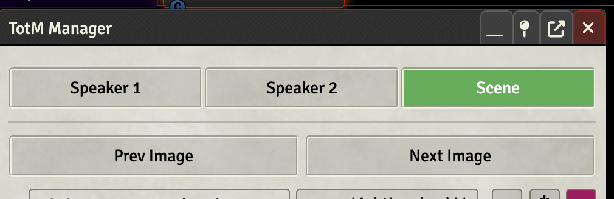
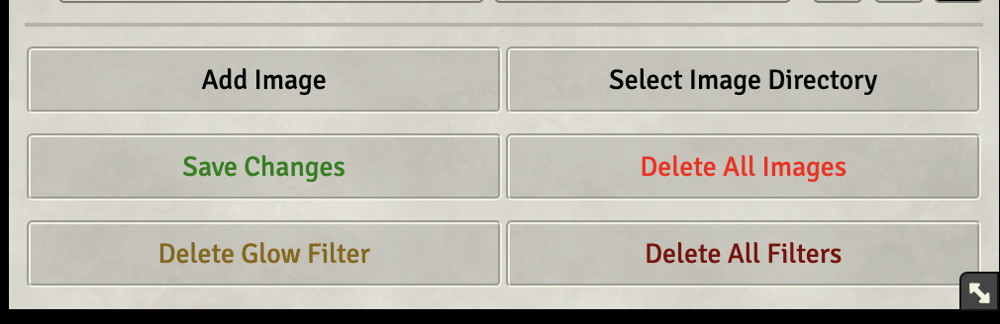
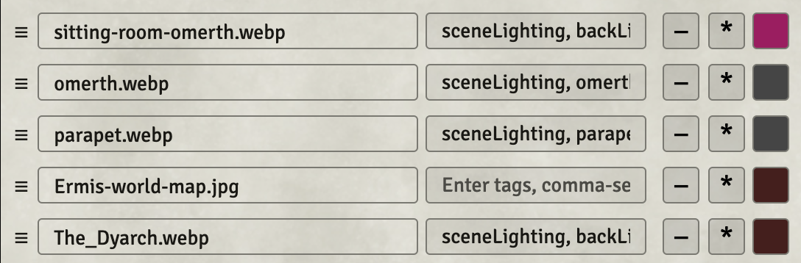

Theater of the mind Manager (TotM Manager) is designed to help you, the GM, manage visual and thematic elements for theater of the mind style play in Foundry VTT.

The module is in its early stages, but it allows you to 

1. Add individual images or directories of images to a tile
2. Preview and switch between images on a tile
3. Select between speaker and scene tiles via tag (and the [Tagger](https://github.com/fantasycalendar/FoundryVTT-Tagger) module)
4. Add glow effects to a tile (via [Token Magic](https://github.com/Feu-Secret/Tokenmagic))

A sample template for use with the TotM Manager is included in a compendium. But you can also create your own tiles and set tags for use with those tiles.

Using the Tagger module, you can tag lights and sounds to run with particular images, so that when you switch to those images the lighting changes, or sounds are played (or both). This can effectively allow you to change the scenery without changing the Foundry scene.

All tags and image data are stored in the metadata of the scene tiles, so nothing is altered in your actual files. To add the module in Foundry just go to the [releases](https://github.com/LichFactory-Games/TotM-Manager/releases) tab and copy the link for the `module.json` into the Foundry "Manifest URL" field in the "Install Module" window.

Also be sure to import the TotM Template from the compendium. It comes with three tiles, and "frames" for those image tiles, pretagged and ready for images. 

As mentioned above, the module has two dependencies for proper functioning -- Tagger and Token Magic. 

While manipulating images on tiles is something that can be done effectively with a package like [Monk's Active Tile Triggers](https://github.com/ironmonk88/monks-active-tiles), this module is specifically intended for theatre of the mind use. It also allows more flexibility to quickly add images or effects than is allowed with Monk's module. 

Here you can see an example of a scene set using three tiles and the TotM Manager.

## How To Use TotM Manager

The manager is designed to work with tiles that have been tagged with either "scene" or "speaker1" or "speaker2". In the case of the template provided, speaker1 and speaker2 are on the left and scene is to their right, taking up most of the rest of the canvas. There are also "frame" tiles (the images are included in the module). You can change these frames to other images or remove them altogether. As the tags names indicate, the speaker tiles are intended to have images of NPCs, and the scene tile to host various images of scenery. The images on each tile may be controlled individually from the TotM Manager window. The frame tiles are for framing the images and should be set to be on top of the image tiles (make sure their Z axis is higher than the z-axis of the image tiles). 

At the bottom of the window there are several buttons. Images may be added to a tile via the file picker, or you may choose to add an entire directory of images. You can also delete an entire set of images associated with a tile, as well as control the various glow filters attached to an image. 

In the center of the window is the image list itself. Images may be reordered by dragging and dropping. Each image may be previewed by hovering over it's name field. If the user would like to link a particular light setup or anything else that can be tagged, the next field allows a list of tags. 

For example, let's say you have two images, A and B. You want image A to have pulsing red lighting, while image B should be placid with normal white light. You can accomplish this by setting up the pulsing red lighting for A and the normal white lighting for B (positioned however you want). You then tag all the lights with the tag "sceneLighting" and use a specific tag, such as "pulse" for A's lights, and another tag, such as "normal", for B's lights. In the tag fields for the images in the TotM Manager window you would put "sceneLighting" and the respective tags for A and B. Then, when activating each image only lights matching the tags in that image's tag field will light. You can do something similar for sounds or anything else that takes a tag. 

TotM Manger can also attach specific playlists or macros to images so long as you have their respective IDs. In the image tags field you can add playlists by using the tag 'play-ID' and call a macro using the tag 'macro-ID'. This allows you to, for example, have images where the lights do a flicker effect while a thunder playlist plays. 

**Note that the scene must be active for lights and related effects to trigger by image.**

You may also delete the image by pressing the `-` button, activate the image by pressing the `*` button, or add a glow filter to the image frame by picking a color from the color picker and activating the image. These filters apply only to the specific image and each filter can be removed by deleting it using the 'delete filter' button at the bottom of the window. 

Be sure to **save any changes** you make to an image by pressing the 'Save Changes' button!

## Search

If you have a tile with a lot of images you may find searching by image name or tag helpful. There is a search bar immediately above the image list that you can use to navigate images. It will give you a preview of all candidates. Press `Enter` to activate the first image in the list. You may also click on any image returned in the search to activate it. 

## Settings 

Settings right now are limited to keybindings (Ctrl-T for the window; Ctrl-F for search) and to image preview size. 

## Feature Roadmap

The following features are ones I would consider adding at some point. 

- [ ] Allow fine-grained control over color filter settings 
- [ ] Allow for other tile setups and more than two speakers or one scene
- [X] Search function for images by name or tag. Helpful in cases where many images are connected with a tile. 
- [ ] Video file support.
- [ ] Support for more TokenMagic FX filters than glow (and possibly adding FXMaster support in addition to Token Magic). 
- [ ] Ability to target and edit a text drawing for labeling of the scene/NPCs.
- [ ] Finer controls for mass adding or deleting images (e.g. ability to select "Avatar" images from a Tokenizer folder and exclude all "Token" images).
- [ ] Remove as many hard-coded variable names as possible & make them user definable
  - [X] Make keybinding for opening manager configurable.
  - [ ] Allow different tags than 'scene', 'speaker1', 'speaker2', etc. 
  - [X] Allow preview image size to be user determined
  - [X] Add user accessible keybindings 

## Thanks

Special thanks to [Monk's Active Tile Triggers](https://github.com/ironmonk88/monks-active-tiles) and [this youtube video](https://www.youtube.com/watch?v=Uq1y7l7DcoU) by Axium for giving me the original idea to run theater of the mind in Foundry by manipulating tiles. 
